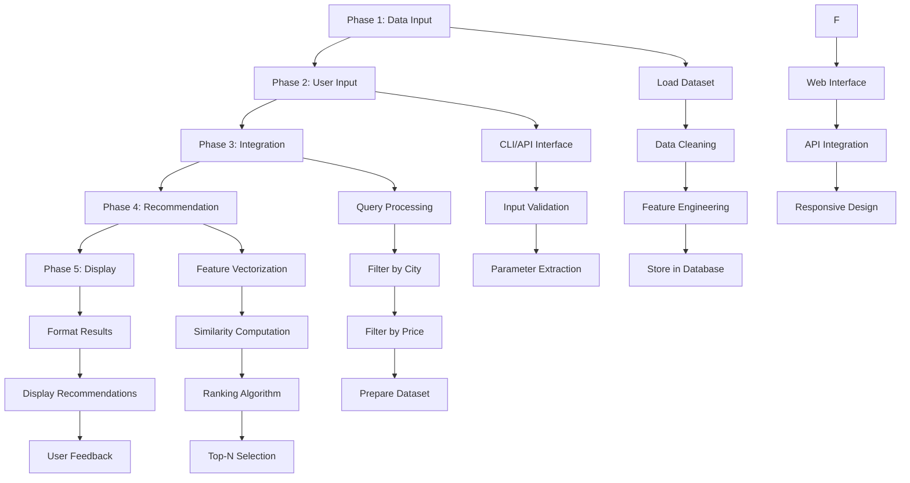
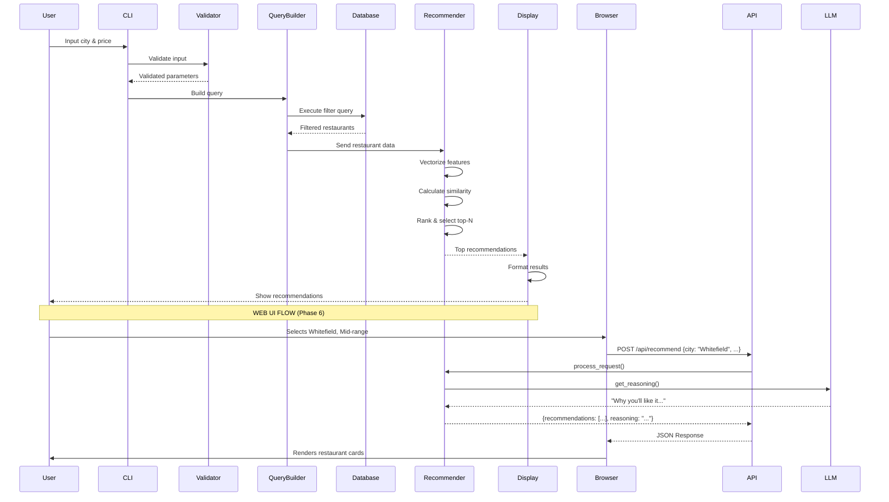

# Zomato AI Restaurant Recommendation Service - Architecture
> **Helping you find the best places to eat in bangalore city**

## Overview

This document outlines the architecture for an AI-powered restaurant recommendation service using the Zomato dataset. The system accepts user inputs (city and price range) and provides personalized restaurant recommendations through a 6-phase development approach.

## Dataset

**Source**: [Zomato Restaurant Recommendation Dataset](https://huggingface.co/datasets/ManikaSaini/zomato-restaurant-recommendation)

**Loading Method**:
```python
from datasets import load_dataset
ds = load_dataset("ManikaSaini/zomato-restaurant-recommendation")
```

---

## System Architecture



---

## Phase-wise Development Plan

### **PHASE 1: Input the Zomato Data**

**Objective**: Load, process, and prepare the Zomato dataset for the recommendation system.

#### Components:

1. **Data Loader**
   - Load dataset from Hugging Face using `datasets` library
   - Handle dataset splits (train/test if available)
   - Implement error handling for network issues

2. **Data Cleaning Module**
   - Remove duplicates
   - Handle missing values (null cuisines, ratings, etc.)
   - Standardize text fields (city names, cuisine types)
   - Remove invalid entries (negative prices, invalid coordinates)

3. **Feature Engineering**
   - Extract relevant features:
     - Restaurant name
     - City/location
     - Cuisines offered
     - Average cost for two
     - Rating (aggregate and votes)
     - Address and locality
     - Online delivery availability
     - Table booking availability
   - Create derived features:
     - Price category (budget, mid-range, premium)
     - Popularity score (based on votes and ratings)
     - Cuisine diversity index

4. **Data Storage**
   - Store processed data in SQLite/PostgreSQL database
   - Create indexes on frequently queried columns (city, price_category)
   - Implement data versioning for updates

#### Technologies:
- `datasets` (Hugging Face)
- `pandas` for data manipulation
- `sqlite3` or `sqlalchemy` for database operations
- `numpy` for numerical operations

#### Deliverables:
- `data_loader.py`: Dataset loading and initial processing
- `data_cleaner.py`: Data cleaning and validation
- `feature_engineer.py`: Feature extraction and engineering
- `database_setup.py`: Database schema and initialization
- `config.py`: Configuration for data paths and parameters

---

### **PHASE 2: User Input**

**Objective**: Create an interface to capture user preferences (city and price range).

#### Components:

1. **Input Interface**
   - CLI (Command Line Interface) for initial development
   - REST API endpoints for future web/mobile integration
   - Input fields:
     - City (required)
     - Price range (required)
     - Optional filters:
       - Cuisine preference
       - Rating threshold
       - Online delivery requirement
       - Table booking requirement

2. **Input Validation**
   - Validate city exists in database
   - Validate price range format and values
   - Provide suggestions for misspelled cities
   - Set default values for optional parameters

3. **Parameter Extraction**
   - Parse user input into structured format
   - Convert price range to numeric values
   - Normalize city names (case-insensitive matching)
   - Handle multiple input formats

#### Technologies:
- `argparse` or `click` for CLI
- `FastAPI` or `Flask` for REST API (optional)
- `pydantic` for input validation and data models

#### Deliverables:
- `user_interface.py`: CLI implementation
- `input_validator.py`: Input validation logic
- `models.py`: Pydantic models for user input
- `api.py`: REST API endpoints (optional)

---

### **PHASE 3: Integration**

**Objective**: Connect user input with the dataset to filter and prepare relevant restaurants.

#### Components:

1. **Query Builder**
   - Construct database queries based on user input
   - Implement efficient filtering strategies
   - Handle edge cases (no results, too many results)

2. **City Filter**
   - Filter restaurants by exact city match
   - Implement fuzzy matching for similar city names
   - Handle city aliases and variations

3. **Price Filter**
   - Filter by price range (min-max)
   - Map price categories to actual cost values
   - Consider currency and regional variations

4. **Data Preparation**
   - Retrieve filtered dataset from database
   - Load into memory-efficient data structure
   - Prepare feature vectors for recommendation engine

5. **Caching Layer**
   - Cache frequently requested city-price combinations
   - Implement cache invalidation strategy
   - Optimize query performance

#### Technologies:
- `sqlalchemy` for ORM and query building
- `redis` for caching (optional)
- `pandas` for data manipulation

#### Deliverables:
- `query_builder.py`: Database query construction
- `filter_engine.py`: Filtering logic implementation
- `cache_manager.py`: Caching layer (optional)
- `data_preparer.py`: Data preparation for recommendation

---

### **PHASE 4: Recommendation**

**Objective**: Implement AI-powered recommendation algorithm to suggest best restaurants.

#### Components:

1. **Feature Vectorization**
   - Convert restaurant features to numerical vectors
   - Techniques:
     - TF-IDF for cuisine and text features
     - One-hot encoding for categorical features
     - Normalization for numerical features (rating, cost)
   - Create combined feature matrix

2. **Recommendation Engine**
   - **Content-Based Filtering**:
     - Cosine similarity between restaurants
     - Weight features by importance (rating > cuisine > price)
   - **Collaborative Filtering** (future enhancement):
     - User-based or item-based filtering
     - Matrix factorization techniques
   - **Hybrid Approach**:
     - Combine multiple algorithms
     - Weighted scoring system

3. **Ranking Algorithm**
   - Score restaurants based on:
     - Similarity to user preferences
     - Rating and popularity
     - Distance from city center (if location provided)
   - Apply business rules:
     - Boost highly-rated restaurants
     - Penalize restaurants with few votes
     - Promote diverse cuisine options

4. **Top-N Selection**
   - Select top N recommendations (default: 10)
   - Ensure diversity in results
   - Remove near-duplicates

#### Technologies:
- `scikit-learn` for ML algorithms
- `numpy` and `scipy` for numerical computations
- `sentence-transformers` for advanced text embeddings (optional)

#### Deliverables:
- `vectorizer.py`: Feature vectorization logic
- `recommender.py`: Core recommendation engine
- `ranker.py`: Ranking and scoring algorithms
- `similarity_calculator.py`: Similarity computation

---

### **PHASE 5: Display to the User**

**Objective**: Present recommendations in a user-friendly format.

#### Components:

1. **Result Formatter**
   - Format restaurant data for display
   - Include key information:
     - Restaurant name
     - Cuisine types
     - Average cost for two
     - Rating and votes
     - Address and locality
     - Online delivery/table booking status
   - Sort by recommendation score

2. **Display Interface**
   - **CLI Output**:
     - Formatted table view
     - Color-coded ratings
     - Numbered list for easy reference
   - **JSON Response** (for API):
     - Structured JSON with all details
     - Include metadata (total results, query time)
   - **Rich Output**:
     - Use `rich` library for enhanced CLI display
     - Include emojis and formatting

3. **User Feedback Collection**
   - Optional rating system for recommendations
   - Track user selections
   - Store feedback for future improvements

4. **Export Options**
   - Save results to CSV/JSON file
   - Generate shareable links (future)
   - Email recommendations (future)

#### Technologies:
- `rich` or `tabulate` for CLI formatting
- `json` for API responses
- `pandas` for data export

#### Deliverables:
- `formatter.py`: Result formatting logic
- `display.py`: Display interface implementation
- `feedback_collector.py`: User feedback handling
- `exporter.py`: Export functionality

---

### **PHASE 6: UI Frontend Development**

**Objective**: Create a modern, interactive web interface for the recommendation service.

#### Components:

1. **Web Interface**
   - Modern React or Vue.js frontend
   - Interactive search and filter controls
   - Visual recommendation cards with AI reasoning

2. **Backend API Integration**
   - FastAPI backend exposing Phase 4/5 logic as REST endpoints
   - POST `/recommend`: Accepts user criteria and returns reasoned matches
   - POST `/feedback`: Submits user rating for a recommendation

3. **Frontend Utility**
   - Async API requests (using Axios or Fetch)
   - State management for search results
   - Responsive design (Tailwind CSS) for mobile and desktop

#### Technologies:
- **Frontend**: Vanilla JavaScript, HTML5, CSS3
- **Backend API**: FastAPI / Flask
- **Communication**: REST / JSON

#### [frontend/](file:///c:/Lekhya/zomato-2/frontend/)
- `index.html`: Base structure with premium layout.
- `style.css`: Custom CSS variables, glassmorphism, and responsive grid.
- `app.js`: Logic for fetching and rendering restaurant cards.
- `apiService.js`: Fetch wrapper for local API.
- `api_main.py`: FastAPI server entry point
- `integration.md`: API documentation and frontend-backend setup

#### **Web Frontend Architecture (Vanilla JS)**

The frontend is a lightweight, high-performance Single Page Application (SPA) built using Vanilla JavaScript, semantic HTML5, and Modern CSS (including Flexbox/Grid).

**1. Structure**
- `index.html`: Main structure and layout containers.
- `style.css`: Premium design system with glassmorphism and animations.
- `app.js`: Application logic, event handling, and DOM manipulation.
- `apiService.js`: Encapsulated fetch logic for backend communication.

**2. State Management**
- **Data Stores**: Simple JavaScript objects to track search criteria and recommendation results.
- **DOM Reconciliation**: Manual DOM updates using templates and efficient innerHTML/appendChild patterns.
- **Loading UI**: CSS-driven overlays and spinners managed via JS class toggles.

**3. Integration Pattern**
- **Static Hosting**: The FastAPI backend serves the `frontend/` directory as static files.
- **Async/Await**: Uses modern JavaScript features for non-blocking API communication.

---

## Data Flow



---

## API Specification (Phase 6 Integration)

The backend provides a RESTful interface for the frontend to consume.

### 1. Get Recommendations
- **Endpoint**: `POST /api/recommend`
- **Request Body**:
  ```json
  {
    "city": "string",
    "price_range": "string",
    "cuisine": "string (optional)",
    "min_rating": "float"
  }
  ```
- **Response**:
  ```json
  {
    "status": "success",
    "data": {
      "recommendations": [
        {
          "name": "string",
          "rating": 4.5,
          "reasoning": "AI generated explanation..."
        }
      ]
    }
  }
  ```

### 2. Submit Feedback
- **Endpoint**: `POST /api/feedback`
- **Request Body**:
  ```json
  {
    "restaurant_id": "string",
    "rating": 5,
    "comment": "string"
  }
  ```

---

## Frontend-Backend Integration

### Integration Architecture:
The system uses a **Standard REST Adapter Pattern**:
- **Backend (FastAPI)**: Acts as an orchestration layer. It receives the schema-validated request, calls the `LLMRecommender` (which uses the SQLite database and Groq API), and transforms the results into a standardized JSON response.
- **Frontend (React)**: Uses a service-based pattern (`apiService.js`) to handle asynchronous calls, retry logic, and error boundaries.

### Performance & Security:
- **CORS Handling**: Backend pre-configured to allow requests from the React dev server.
- **Lazy Loading**: Frontend lists are virtualized (optional) for large results.
- **Environment Variables**: API endpoints and keys managed via `.env` files on both layers.

---

## Project Structure

```
zomato-2/
├── data/
│   ├── raw/                    # Raw dataset from Hugging Face
│   ├── processed/              # Cleaned and processed data
│   └── database/               # SQLite database file
├── phase1/
│   ├── data_loader.py
│   ├── data_cleaner.py
│   ├── feature_engineer.py
│   └── database_setup.py
├── phase2/
│   ├── user_interface.py
│   ├── input_validator.py
│   ├── models.py
│   └── api.py
├── phase3/
│   ├── query_builder.py
│   ├── filter_engine.py
│   ├── cache_manager.py
│   └── data_preparer.py
├── phase4/
│   ├── vectorizer.py
│   ├── recommender.py
│   ├── ranker.py
│   └── similarity_calculator.py
├── phase5/
│   ├── formatter.py
│   ├── display.py
│   ├── feedback_collector.py
│   └── exporter.py
├── phase6/                      # UI Integration Layer
│   └── api_server.py           # FastAPI/Flask server
├── frontend/                    # Web Frontend Code
│   ├── public/
│   ├── src/
│   │   ├── components/         # Reusable React components
│   │   ├── services/           # API communication layer
│   │   ├── App.js              # Root component
│   │   └── index.js
│   └── package.json
├── tests/
│   ├── test_phase1.py
│   ├── test_phase2.py
│   ├── test_phase3.py
│   ├── test_phase4.py
│   └── test_phase5.py
├── config.py                   # Global configuration
├── main.py                     # Main application entry point
├── requirements.txt            # Python dependencies
└── README.md                   # Project documentation
```

---

## Key Technologies Stack

| Component | Technology |
|-----------|-----------|
| **Language** | Python 3.8+ |
| **Data Processing** | pandas, numpy |
| **ML/AI** | scikit-learn, scipy |
| **Database** | SQLite/PostgreSQL |
| **Dataset** | Hugging Face datasets |
| **CLI** | argparse/click, rich |
| **API** | FastAPI/Flask (optional) |
| **Validation** | pydantic |
| **Testing** | pytest |
| **Caching** | redis (optional) |

---

## Development Workflow

1. **Phase 1**: Set up data pipeline and database
2. **Phase 2**: Build user input interface
3. **Phase 3**: Implement filtering and integration
4. **Phase 4**: Develop recommendation algorithm
5. **Phase 5**: Create display and output system
6. **Phase 6**: Integrate Web UI and REST API

Each phase should be:
- Developed independently
- Unit tested thoroughly
- Integrated incrementally
- Documented with examples

---

## Performance Considerations

1. **Database Indexing**: Index city and price columns for fast filtering
2. **Caching**: Cache popular queries to reduce computation
3. **Vectorization**: Pre-compute feature vectors where possible
4. **Batch Processing**: Process multiple recommendations efficiently
5. **Memory Management**: Use generators for large datasets

---

## Future Enhancements

1. **User Profiles**: Store user preferences and history
2. **Collaborative Filtering**: Learn from user behavior
3. **Location-based**: Use GPS for nearby recommendations
4. **Real-time Updates**: Sync with live Zomato data
5. **Multi-criteria**: Support more filters (ambiance, dietary restrictions)
6. **Web Interface**: Build React/Vue.js frontend
7. **Mobile App**: Native iOS/Android applications

---

## Success Metrics

- **Accuracy**: Recommendations match user preferences
- **Performance**: Response time < 2 seconds
- **Coverage**: Handle all cities in dataset
- **Diversity**: Varied cuisine types in recommendations
- **User Satisfaction**: Positive feedback on suggestions
