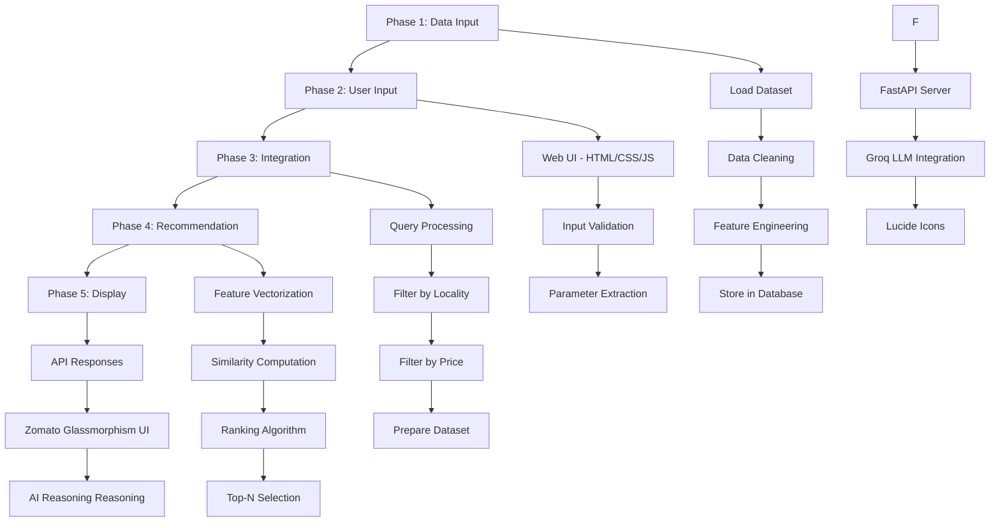

# Zomato AI Restaurant Recommendation Service - Architecture
> **Helping you find the best places to eat in bangalore city**

## Overview

This document outlines the architecture for an AI-powered restaurant recommendation service using the Zomato dataset. The system accepts user inputs (locality and price range) and provides personalized restaurant recommendations through a modern glassmorphism web interface and an AI reasoning layer.

## Dataset

**Source**: [Zomato Restaurant Recommendation Dataset](https://huggingface.co/datasets/ManikaSaini/zomato-restaurant-recommendation)

**Loading Method**:
```python
from datasets import load_dataset
ds = load_dataset("ManikaSaini/zomato-restaurant-recommendation")
```

---

## System Architecture



---

## Phase-wise Development Plan

### **PHASE 1: Input the Zomato Data**
**Objective**: Load, process, and prepare the Zomato dataset for the recommendation system.

### **PHASE 2: User Input**
**Objective**: Create an interface to capture user preferences (locality and price range).

### **PHASE 3: Integration**
**Objective**: Connect user input with the dataset to filter and prepare relevant restaurants.

### **PHASE 4: Recommendation (AI Reasoning)**
**Objective**: Implement AI-powered recommendation algorithm to suggest best restaurants and provide reasoning via Groq LLM.

### **PHASE 5: Display & Frontend**
**Objective**: Present recommendations in a premium glassmorphism web format and collect feedback.

### **PHASE 6: API Layer**
**Objective**: Expose the logic via FastAPI to serve the modern frontend.

---

## Project Structure

```
zomato-2/
├── data/
│   └── database/               # SQLite database file
├── frontend/                   # Modern Web UI (HTML, CSS, JS)
│   ├── index.html              # Main UI structure
│   ├── style.css               # Glassmorphism styling
│   └── app.js                  # Frontend logic & API calls
├── phase1/                     # Data processing
├── phase2/                     # Input validation & models
├── phase3/                     # Filtering engine
├── phase4/                     # AI Recommender & Groq integration
├── phase6/                     # FastAPI Server logic
├── main.py                     # Project entry point (Uvicorn)
├── requirements.txt            # Python dependencies
└── architecture.md             # System documentation
```

---

## Key Technologies Stack

| Component | Technology |
|-----------|-----------|
| **Language** | Python 3.8+ |
| **Backend** | FastAPI / Uvicorn |
| **Frontend** | Vanilla JS / CSS (Glassmorphism) |
| **AI/LLM** | Groq (Llama-3) |
| **Data Processing** | pandas, numpy |
| **Database** | SQLite |
| **Aesthetics** | Lucide Icons, Google Fonts |

---

## How to Run

### Web Application
```bash
python main.py
```
Then visit `http://localhost:8000` in your browser.
